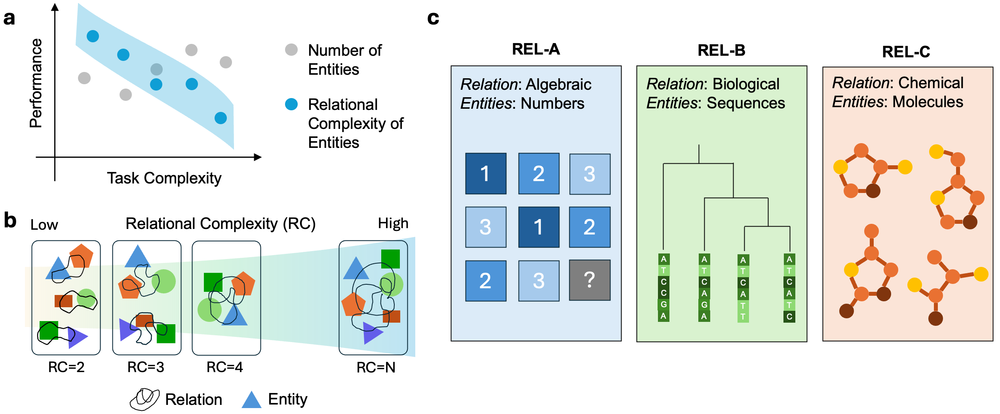
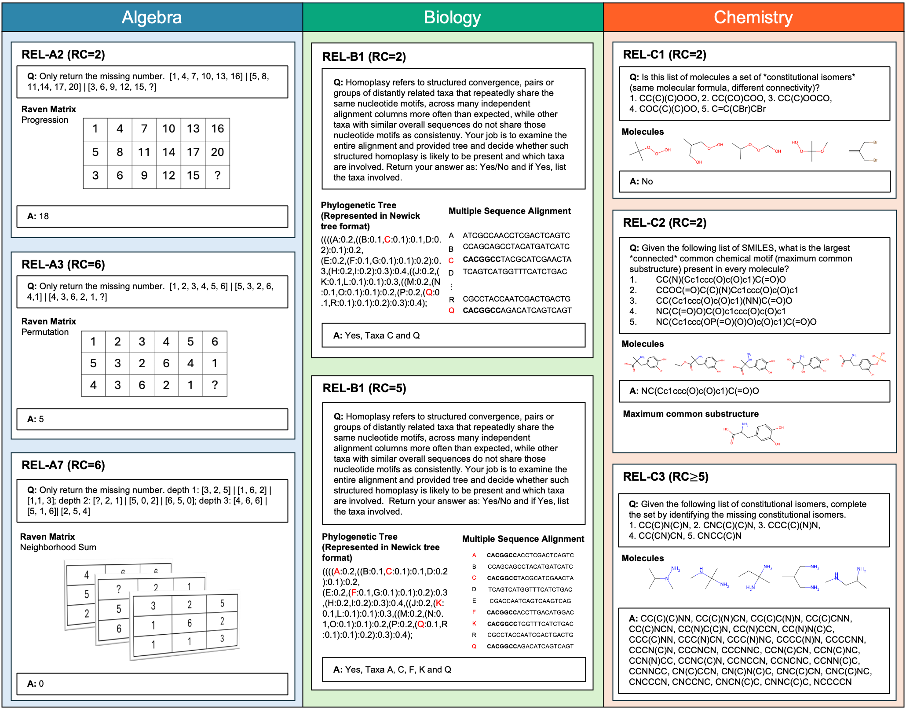

# Exploring Relational Reasoning Capabilities in LLMs with REL

<p align="center">
  <a href="https://arxiv.org/"></a>
  <!-- <a href="https://medea.openscientist.ai/"></a> -->
  <a href="https://huggingface.co/datasets/ada-f/rel"></a>
</p> 

This repository contains the code and data for the paper "Exploring Relational Reasoning Capabilities in LLMs with REL". We include the code for building the datasets, running the experiments, and analyzing the results.



## Example Questions


## Benchmark Format

All datasets are available in a unified JSONL format in the `REL/` directory, organized by domain:
- `REL/chemistry/` - Chemistry datasets (REL-C1, REL-C2, REL-C3)
- `REL/biology/` - Biology datasets (REL-B1)
- `REL/algebra/` - Algebra datasets (REL-A1, REL-A2, REL-A3, REL-A4)

### Shared Format

All datasets follow this common structure:

```json
{
  "id": "unique_identifier",
  "domain": "chemistry" | "biology" | "algebra",
  "task": "task_name",
  "question": "question text",
  "answer": {
    // Domain-specific answer fields (see below)
  },
  "metadata": {
    // Optional metadata
  }
}
```

**Required fields:**
- `id`: Unique identifier for the record
- `domain`: One of "chemistry", "biology", or "algebra"
- `task`: Task identifier (e.g., "REL-C1", "REL-B1", "REL-A1")
- `question`: The question text/prompt
- `answer`: Object containing domain-specific answer fields

### Chemistry Format

**Task types:**
- `REL-C1`: Isomer set yes/no questions
- `REL-C2`: Largest common motif identification
- `REL-C3`: Missing isomers completion

**Answer structure:**
- `label`: "Yes" or "No" (for REL-C1)
- `smiles`: Single SMILES string (for REL-C2)
- `missing_smiles`: List of SMILES strings (for REL-C3)
- `molecules`: List of input molecule SMILES (optional, present in all tasks)

**Example (REL-C1):**
```json
{
  "id": "q2_n5_00001",
  "domain": "chemistry",
  "task": "REL-C1",
  "question": "Is this list of molecules a set of *constitutional isomers*...",
  "answer": {
    "label": "Yes",
    "molecules": ["CC(C)C(Br)=CBr", "CC1(Br)CC1(C)Br", ...]
  },
  "metadata": {"formula": "C5H8Br2", "constructed_label": "Yes"}
}
```

**Example (REL-C2):**
```json
{
  "id": "q1a_n5_00001",
  "domain": "chemistry",
  "task": "REL-C2",
  "question": "Given the following list of SMILES, what is the largest...",
  "answer": {
    "smiles": "O=CC1CCC(=O)N1",
    "molecules": ["O=C1CCC(C(=O)Oc2ccc(O)cc2)N1", ...]
  },
  "metadata": {"mcs_num_atoms": 8, "mcs_num_bonds": 8, ...}
}
```

**Example (REL-C3):**
```json
{
  "id": "q3_given5_00301",
  "domain": "chemistry",
  "task": "REL-C3",
  "question": "Given the following list of constitutional isomers...",
  "answer": {
    "missing_smiles": ["BrC(Br)C1CCC1", "BrC(Br)CC1CC1", ...],
    "molecules": ["BrCC(Br)C1CC1", "CC1CC(Br)C1Br", ...]
  },
  "metadata": {"formula": "C5H8Br2", "universe_size": 88, ...}
}
```

### Biology Format

**Task:**
- `REL-B1`: Homoplasy detection

**Answer structure:**
- `label`: "yes" or "no"
- `taxa`: List of integers (taxa IDs involved in homoplasy, empty if label is "no")

**Validation rules:**
- If `label` is "yes", `taxa` must be a non-empty list
- If `label` is "no", `taxa` must be an empty list

**Example:**
```json
{
  "id": "biology_REL-B1_00001",
  "domain": "biology",
  "task": "REL-B1",
  "question": "Homoplasy refers to structured convergence...",
  "answer": {
    "label": "yes",
    "taxa": [15, 49, 18, 28, 20, 39, 29, 42, 16, 31]
  },
  "metadata": {}
}
```

### Algebra Format

**Task types:**
- `REL-A1`, `REL-A2`, `REL-A3`, `REL-A4`: Raven's Progressive Matrices

**Answer structure:**
- `target`: Integer index (0-7) of the correct answer in the choices

**Note:** The raw panel data (`panels` and `choices`) is stored in the `metadata` field for reference.

**Example:**
```json
{
  "id": "algebra_REL-A1_00001",
  "domain": "algebra",
  "task": "REL-A1",
  "question": "Complete the Raven's progressive matrix. Only return the missing panel index (1-8)!\n\nPanel 0:\n[639.43, 25.01, 275.03]\n...\n\nAnswer set:\nAnswer 1: [123.45, 67.89, ...]\n...",
  "answer": {
    "target": 2
  },
  "metadata": {
    "panels": [[[639.43, 25.01, 275.03], ...], ...],
    "choices": [[[123.45, 67.89, ...], ...], ...]
  }
}
```

## Evaluation

Each benchmark provides an `evaluate_response` function that takes a question, answer, and model response, and returns evaluation metrics.

### Chemistry Benchmarks (`chem_benchmark/evaluation.py`)

**Function:** `evaluate_response(question: str, answer: dict, response: str, task: Optional[str] = None) -> dict`

**Response Format:**
- **REL-C1**: Response should contain `<Yes>` or `<No>` tag
- **REL-C2**: Response should contain `<smiles>SMILES_STRING</smiles>` tag
- **REL-C3**: Response should contain multiple `<smiles>SMILES_STRING</smiles>` tags (one per line)

**Input Format:**
- `question`: The question text from the dataset
- `answer`: Answer dict with task-specific fields:
  - REL-C1: `{"label": "Yes" | "No", "molecules": [...]}`
  - REL-C2: `{"smiles": "SMILES_STRING", "molecules": [...]}`
  - REL-C3: `{"missing_smiles": ["SMILES1", "SMILES2", ...], "molecules": [...]}`
- `response`: Model-generated response text
- `task`: Optional task identifier ("REL-C1", "REL-C2", or "REL-C3")

**Metrics Computed:**

**REL-C1:**
- `correct`: bool - True if predicted label matches gold label
- `pred`: str or None - Extracted yes/no prediction
- `gold`: str - Gold label ("Yes" or "No")

**REL-C2:**
- `correct`: bool - True if response SMILES is a substructure of correct OR correct is a substructure of response
- `pred`: str or None - Extracted SMILES from response
- `gold`: str - Correct SMILES
- `response_is_substructure_of_correct`: bool - Whether response is substructure of correct
- `correct_is_substructure_of_response`: bool - Whether correct is substructure of response
- `overlap_metric`: float - Atom overlap metric (0.0-1.0) using Maximum Common Substructure

**REL-C3:**
- `correct`: bool - True if exact match (all predicted match all gold)
- `pred`: list[str] - Extracted SMILES list from response
- `gold`: list[str] - Gold SMILES list
- `tp`: int - True positives (correctly predicted isomers)
- `fp`: int - False positives (predicted but not in gold)
- `fn`: int - False negatives (in gold but not predicted)
- `precision`: float - Precision score
- `recall`: float - Recall score
- `f1`: float - F1 score

**Note:** Both REL-C2 and REL-C3 use isomorphic SMILES matching to check if SMILES represent the same molecule (handles non-canonical SMILES). REL-C2 only considers the response correct if it represents the same molecule as the gold answer.

**Example:**
```python
from chem_benchmark.evaluation import evaluate_response

question = "Given the following list of SMILES, what is the largest..."
answer = {"smiles": "O=CC1CCC(=O)N1", "molecules": [...]}
response = "<smiles>O=C1CCC(C=O)N1</smiles>"

result = evaluate_response(question, answer, response, task="REL-C2")
print(result)
# {
#   "correct": True,
#   "pred": "O=C1CCC(C=O)N1",
#   "gold": "O=CC1CCC(=O)N1",
#   "response_is_substructure_of_correct": True,
#   "correct_is_substructure_of_response": True,
#   "overlap_metric": 1.0
# }
```

### Biology Benchmark (`bio_benchmark/evaluation.py`)

**Function:** `evaluate_response(question: str, answer: dict, response: str, task: Optional[str] = None) -> dict`

**Response Format:**
- Response should contain "yes" or "no" (case-insensitive)
- If "yes", response should list taxa IDs (e.g., "taxon_1", "taxon_2" or just numbers)

**Input Format:**
- `question`: The question text from the dataset
- `answer`: Answer dict with `{"label": "yes" | "no", "taxa": [int, ...]}`
- `response`: Model-generated response text
- `task`: Optional task identifier (defaults to "REL-B1")

**Metrics Computed:**
- `correct`: bool - True if label matches and (for "yes" answers) there's taxa overlap
- `pred_label`: str or None - Extracted label ("yes", "no", or None if parsing failed)
- `gold_label`: str - Gold label ("yes" or "no")
- `pred_taxa`: list[str] - Extracted taxa IDs from response
- `gold_taxa`: list[int] - Gold taxa IDs
- `precision`: float - Taxa precision (-1 if gold_taxa is empty)
- `recall`: float - Taxa recall (-1 if gold_taxa is empty)
- `f1`: float - Taxa F1 score (-1 if gold_taxa is empty)

**Example:**
```python
from bio_benchmark.evaluation import evaluate_response

question = "Homoplasy refers to structured convergence..."
answer = {"label": "yes", "taxa": [15, 49, 18, 28, 20]}
response = "Yes. The taxa involved are taxon_15, taxon_49, taxon_18, taxon_28, taxon_20."

result = evaluate_response(question, answer, response, task="REL-B1")
print(result)
# {
#   "correct": True,
#   "pred_label": "yes",
#   "gold_label": "yes",
#   "pred_taxa": ["15", "49", "18", "28", "20"],
#   "gold_taxa": [15, 49, 18, 28, 20],
#   "precision": 1.0,
#   "recall": 1.0,
#   "f1": 1.0
# }
```

### Algebra Benchmarks (`algebra_benchmark/evaluation.py`)

**Function:** `evaluate_response(question: str, answer: dict, response: str, task: Optional[str] = None, *, n_attr: int = 1, n_return: int = 1) -> dict`

**Response Format:**
- Response should contain answer index as "Answer N" (where N is 1-8) or just a number (1-8)
- The function extracts the answer index and converts to 0-based (0-7)

**Input Format:**
- `question`: The question text from the dataset
- `answer`: Answer dict with `{"target": int}` (0-based index, 0-7)
- `response`: Model-generated response text
- `task`: Optional task identifier ("REL-A1" through "REL-A7")
- `n_attr`: Number of attributes (for compatibility, default 1)
- `n_return`: Number of return values (for compatibility, default 1)

**Metrics Computed:**
- `correct`: bool - True if predicted index matches gold target index
- `pred`: int - Predicted answer index (0-7, clamped)
- `gold`: int - Gold target index (0-7)

**Example:**
```python
from algebra_benchmark.evaluation import evaluate_response

question = "Complete the Raven's progressive matrix. Only return the missing panel index (1-8)!\n..."
answer = {"target": 0}  # 0-based index (Answer 1 in 1-based)
response = "Answer 1"

result = evaluate_response(question, answer, response, task="REL-A1")
print(result)
# {
#   "correct": True,
#   "pred": 0,
#   "gold": 0
# }
```

### Running Tests

Test files with example evaluations are available:
- `chem_benchmark/test_evaluation.py` - Chemistry evaluation examples
- `bio_benchmark/test_evaluation.py` - Biology evaluation examples
- `algebra_benchmark/test_evaluation.py` - Algebra evaluation examples

Run tests to see evaluation examples:
```bash
python -m chem_benchmark.test_evaluation
python -m bio_benchmark.test_evaluation
python -m algebra_benchmark.test_evaluation
```

## Citation

If you use this work in your research, please cite:

```bibtex
@article{fesser2026rel,
  title={Exploring Relational Reasoning Capabilities in LLMs with REL},
  author={Fesser, Lukas and Ektefaie, Yasha and Fang, Ada and Kakade, Sham M. and Zitnik, Marinka},
  journal={},
  year={2026}
}
```